App DO-IT Application 
Ngày Thực hiện: 7/1/2026 --> 18/3/2026

DO IT là một ứng dụng quản lý thời gian và công việc (To-Do App) được xây dựng bằng framework Flutter. 
Ứng dụng giúp người dùng theo dõi công việc hàng ngày, lên lịch trình, duy trì năng suất làm việc một cách hiệu quả.

Công nghệ & Thư viện sử dụng

Framework: Flutter

Quản lý trạng thái (State Management): flutter_bloc (Cubit)

Kiến trúc: Clean Architecture (Domain, Data, Presentation)

Backend & Cơ sở dữ liệu:

- Firebase Auth (Xác thực người dùng)

- Firebase Cloud Firestore (Lưu trữ dữ liệu)

- Mockoon (Hỗ trợ Local API testing)

Các package nổi bật khác:

- table_calendar: Hiển thị và quản lý lịch.

- carousel_slider: Hiển thị slider cho màn hình Onboarding và Group tasks.

- mailer & smtp_server: Gửi mã OTP qua email.

- flutter_dotenv: Quản lý biến môi trường bảo mật (ẩn mật khẩu ứng dụng Email).

- shared_preferences: Lưu trạng thái khởi chạy lần đầu (Onboarding).

Các Tính Năng Nổi Bật:

- Đăng Ký/ Đăng Nhập bằng Email và Mật khẩu

- Xác thực tài khoản qua mã OTP gửi qua Email (sử dụng thư viện mailer và SMTP).

- Tính năng Quên mật khẩu / Đặt lại mật khẩu.

- Thêm, Sửa, Xóa và Hoàn thành công việc.

- Ghim (Pin) các công việc quan trọng lên đầu danh sách.

- Phân loại công việc: Chưa hoàn thành (Incomplete) và Đã hoàn thành (Completed).

- Tích hợp lịch (Calendar) cho phép xem và thêm công việc theo từng ngày cụ thể.

- Tìm kiếm công việc theo tên (có tích hợp Debounce để tối ưu hiệu năng).

- Sắp xếp công việc theo thời gian (Mới nhất) hoặc bảng chữ cái (A-Z).

- Tải thêm dữ liệu (Load more) với Throttle.

Các Hình Ảnh Demo Của App DO IT:

  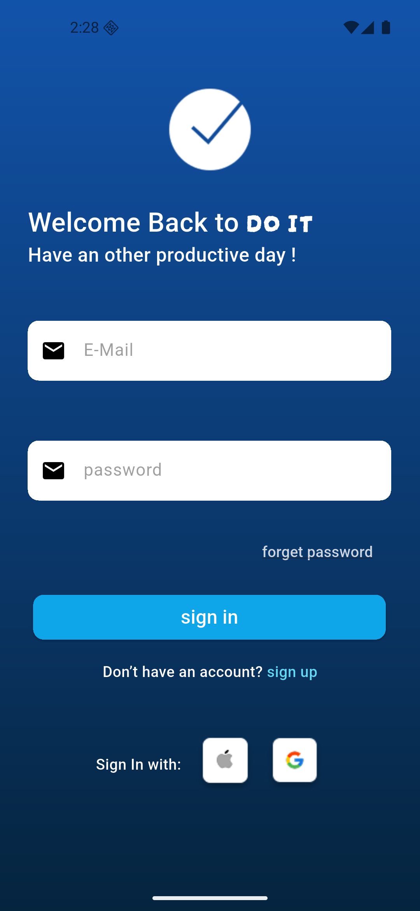
  
  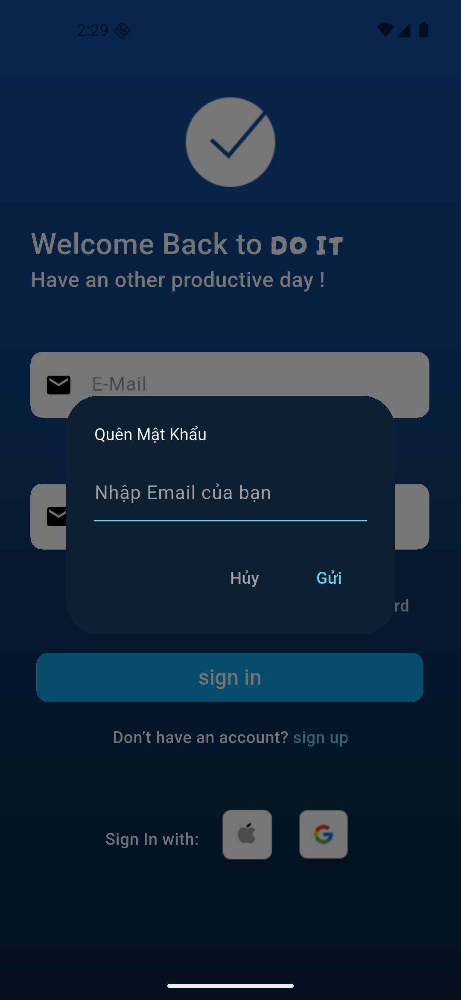
  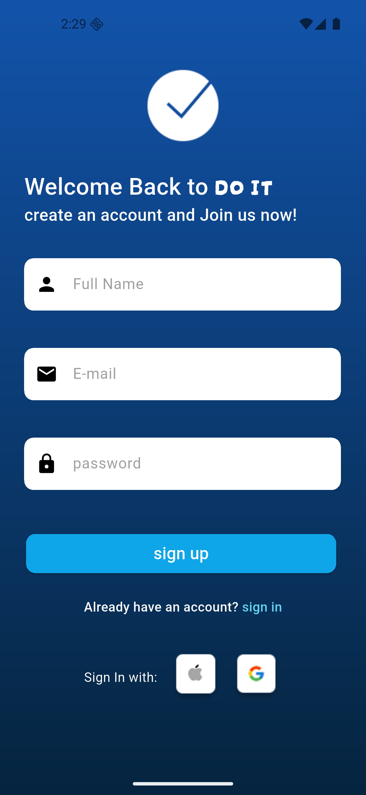
  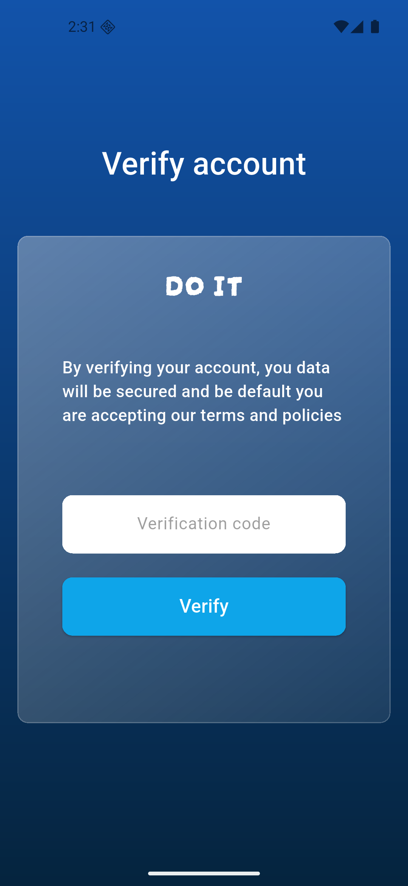
  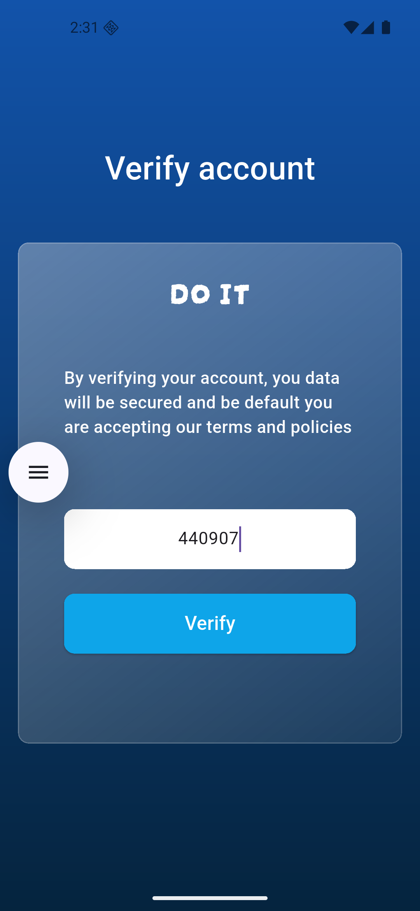
  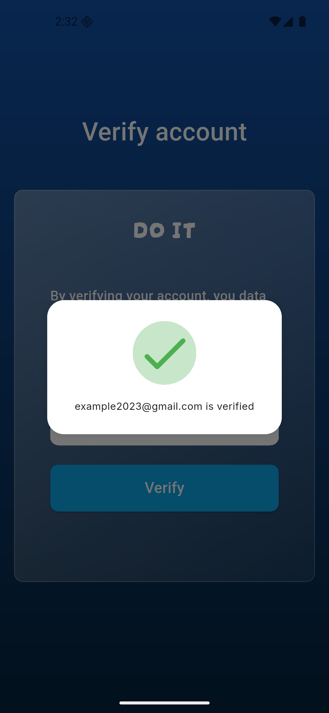
  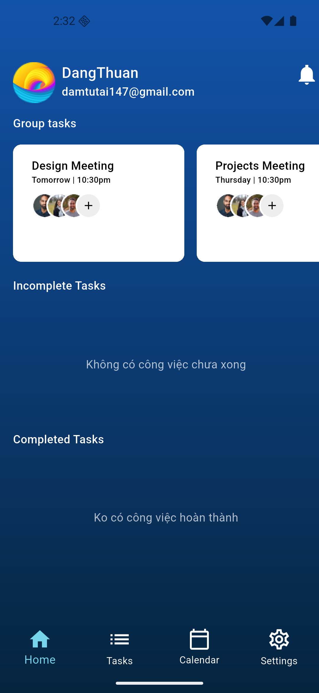
  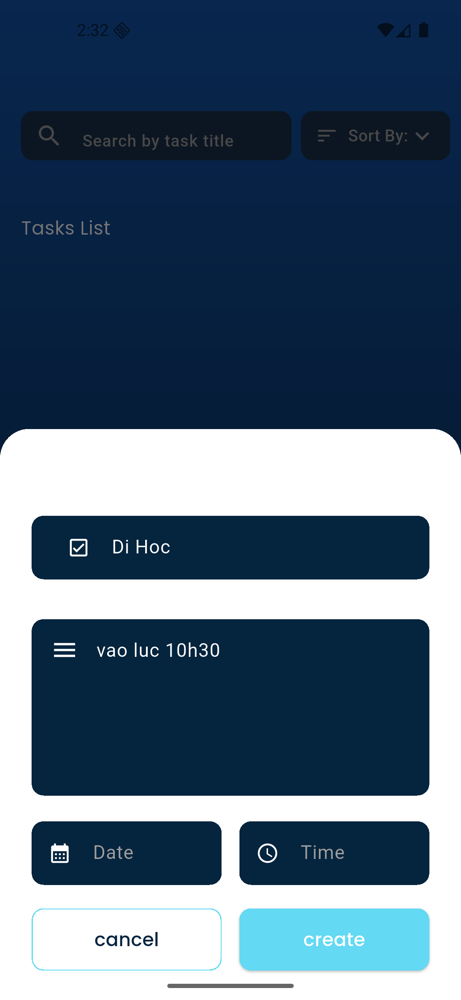
  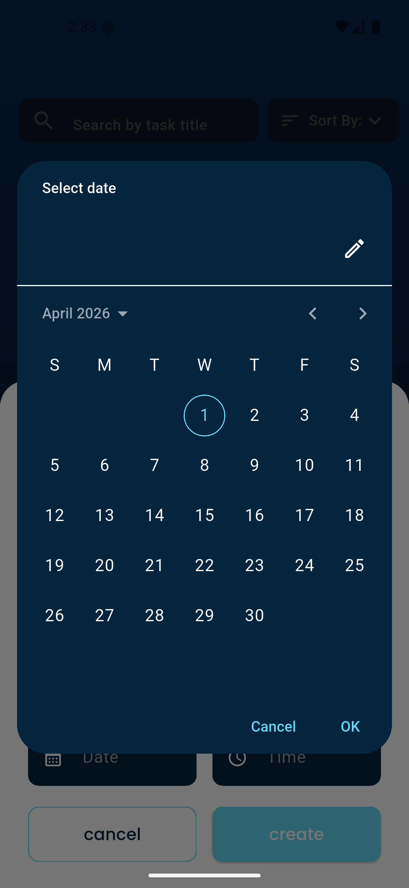
  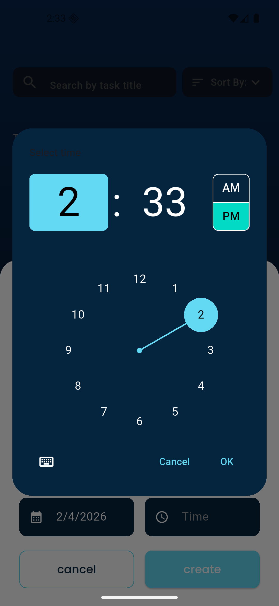
  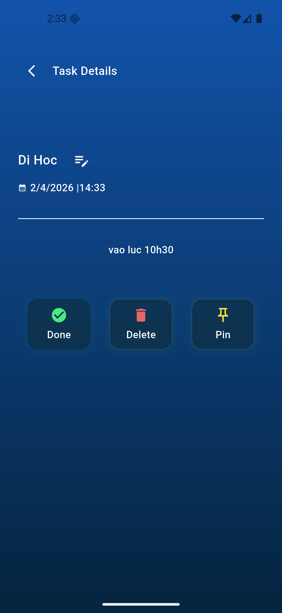
  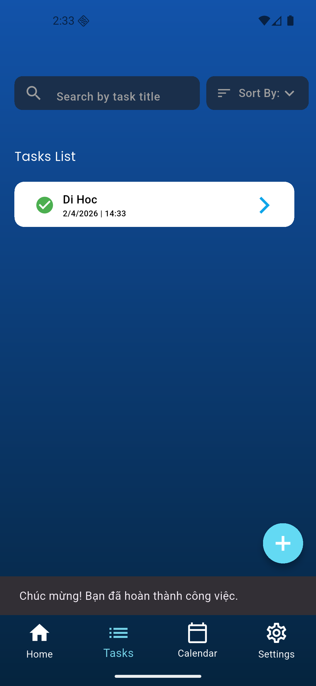
  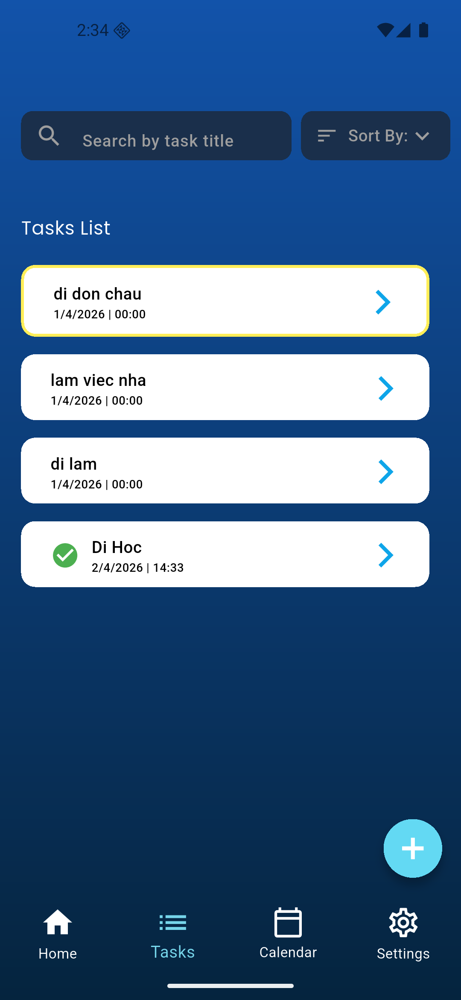
  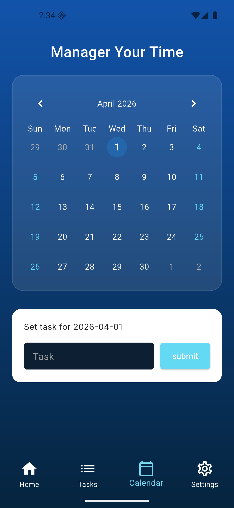
  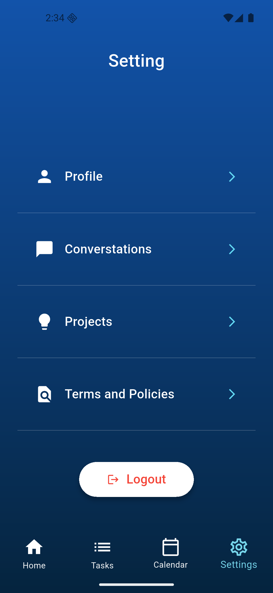
  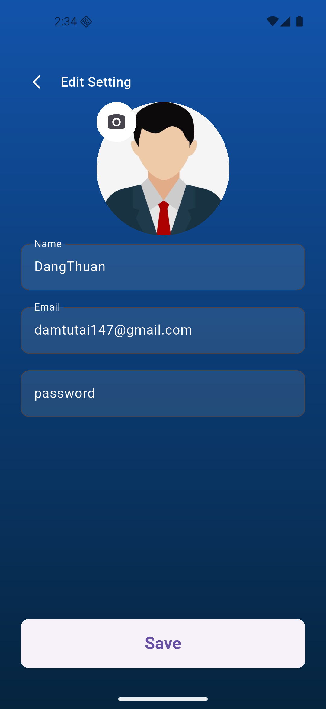
  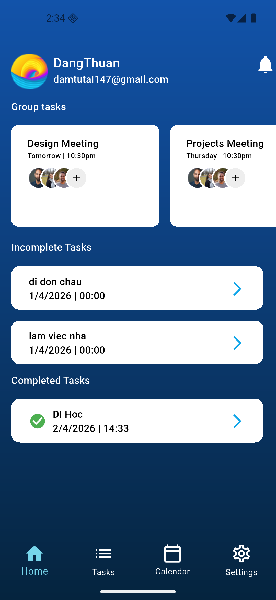
  
  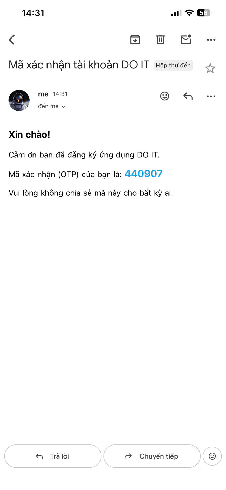
  

